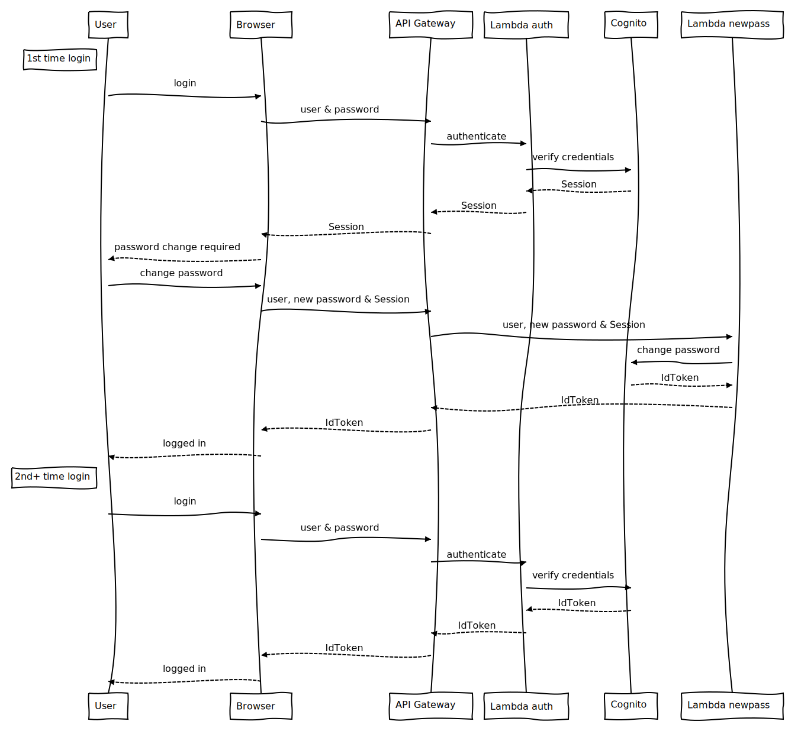

# JAR Runner
Executing JARs on AWS EC2 through UI and Cognito based authentication.

## Architecture
### Basic flow

### Authentication flow

### CloudFormation
The whole solution is wrapped in a single CloudFormation template.

#### Parameters
- `BuildsSourceBucket` - S3 bucket containing source for Lambda functions
- `BuildVersion` - Build version to use - i.e. directory name in `BuildsSourceBucket`
- `JarApiStage` - Name of the stage for REST API endpoint Deployment (e.g. *prod*)
- `ExecutorInstanceType` - EC2 instance type to use for executing jars
- `ExecutorInstanceLimit` - Maximum number of concurrently running executor instances
- `ExecutionParameterConfiguration` - configuration of what parameters can be passed to the jar being executed

#### Requirements
The stack can be deployed in any region, however it needs to be in the same region as `BuildsSourceBucket`. If you wish to deploy to a different region, first copy contents from `BuildsSourceBucket` to a bucket in your desired region and put that bucket name into `BuildsSourceBucket` parameter while deploying the stack.

#### Outputs
##### InputBucketName
##### OutputBucketName
##### InputBucketGroup
##### OutputBucketGroup
##### WebsiteURL
##### NotifyTopic
##### UserPool

### Manual configuration
After the stack deploys successfully, the following needs to be configured.

#### Cognito users
Users of the system, that will be able to schedule JAR executions through Web UI need to have their accounts created in Cognito in the `UserPool` mentioned in CloudFormation's stack outputs section.

#### SNS notifications
To be able to get nofitications on completed executions, subscriptions in SNS have to be created. The easiest is to create email subscription in the `NotifyTopic` SNS topic. See CloudFormation's stack outputs section.

#### Access to input bucket
This is the bucket the jars will be stored and read from. JAR Runner reads the jar from the `jars/` directory of this bucket. Read-write access can be given to people who will be populating this bucket with jars possible to execute. This can be accomplished by creating an IAM user and adding that user to the `InputBucketGroup` group listed in CloudFormation's stack outputs section.

#### Access to output bucket
This bucket contains gzipped output of executions. People who need access to these outputs need read-only access to this bucket. This can be accomplished by creating an IAM user and adding that user to the `OutputBucketGroup` group listed in CloudFormation's stack outputs section.
